# ELDR Estimation

## Results

figure conventions: every metric figure is written as a `.png` + `.pdf` pair with a
`{stem}_table.md` / `{stem}_table.tex` sidecar carrying the plotted numbers
(`ex/utils/tables.py:70`); the markdown sidecar is also pasted, collapsed, directly
beneath each plot below. all figures are untracked build artifacts (`*.png` / `*.pdf` are
gitignored): the embeds below render once the producing step3/step4 or diagnostic script has
been run, and the on-disk path is stated next to each plot. regret is always min-max
normalized across the methods present in a cell, so its shape is comparable across
experiments but its value depends on the method pool.

metric conventions: the headline metrics (ELDR error, regret, pointwise MAE) are all
errors, so lower is better -- marked "(lower is better ↓)" throughout. each metric's
prose states the exact statistic and the stratification it is computed within. as a
rule: box plots show the raw distribution over the cells of one hardness stratum
(median line, IQR box, whisker tails); ELDR error and pointwise MAE line plots show
mean +/- SE over the cells of a stratum; regret line plots are median-based --
median-of-medians with a bootstrapped 25/75 IQR band on eig/elbo, median with a
symmetric +/- bootstrap-std-of-median band on model_selection/dokls.

### synthetic benchmarks (ex/synth)

#### eig (`ex/synth/eig/`)

expected-information-gain estimation for bayesian linear-gaussian designs: EIG(xi) is the
ELDR between the joint p(theta, y | xi) and the product of its marginals, estimated from
10000 joint samples per cell, stratified by design optimality beta = EIG(xi)/EIG_max in
{0.5, 0.6, 0.7, 0.8, 0.9, 0.999} (4 priors x 14 designs per stratum, d = 3).

**ELDR error** (lower is better ↓) -- absolute EIG error, mean +- SE over the 56
(prior, design) cells within each beta stratum: `err[m,c] = |mean_x \hat{r}_m(x) - EIG_true[c]|`
with the mean over the 10000 joint samples (`ex/synth/eig/step3_process_results.py:88`,
aggregation `:155-157`). stored at `ex/synth/eig/figures/eig_eldr_err.png` (+ `.pdf`).

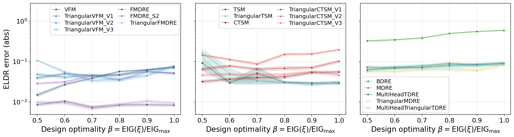

**regret** (lower is better ↓) -- per-cell min-max normalized EIG error, aggregated per
beta stratum as the median-of-medians (median over priors, then over designs) with a
bootstrapped 25/75 IQR band:
`regret[m,c] = (err[m,c] - min_{m'} err[m',c]) / (max_{m'} err[m',c] - min_{m'} err[m',c])`
(normalization `ex/synth/eig/step3_process_results.py:96-103`, median-of-medians `:112-113`,
bootstrap `:124-143`). stored at `ex/synth/eig/figures/eig_regret_mom.png` (+ `.pdf`).

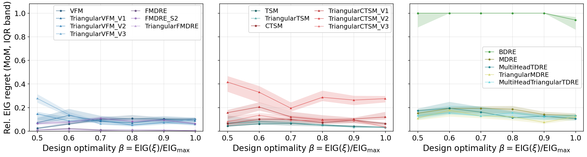

**pointwise MAE** -- not available for eig: the campaign persisted only the integrated
per-cell scalar `est_eigs`, not per-sample LDR vectors
(`ex/synth/eig/step4_plot_estimation_results.py:78-79`).

no datagen diagnostics exist for eig (step1 emits no figures).

#### elbo (`ex/synth/elbo/`)

fractional-posterior ELDR estimation with analytic ground truth: each cell asks for the
ELBO-style quantity `E_q[log p0(theta,y)/p1(theta,y)]` where the fractional posterior q is
interpolated by alpha in {0.1, 0.3, 0.6, 0.9} (near-prior to near-posterior) and design
informativeness beta in {0.16, 0.19, 0.43, 0.97}; grid = 4 beta x 4 alpha strata with 75
(prior, design) cells each = 1200 cells, ~5000 p* samples per cell. one figure per
(metric, alpha).

**ELDR error** (lower is better ↓) -- absolute error against the closed-form truth, mean
+- SE over the 75 (prior, design) cells within each (beta, alpha) stratum:
`err[c] = |\hat{ELDR}[c] - ELDR_analytic[c]|`, `\hat{ELDR} = mean_x \hat{r}(x)` over the
p* samples (`ex/synth/elbo/step3_process_results.py:184`, slicing `:186-194`; analytic
truth `compute_true_eldr` at `:36-74`). stored at
`ex/synth/elbo/figures/elbo_eldr_err_alpha_{0p1,0p3,0p6,0p9}.png` (+ `.pdf` each).

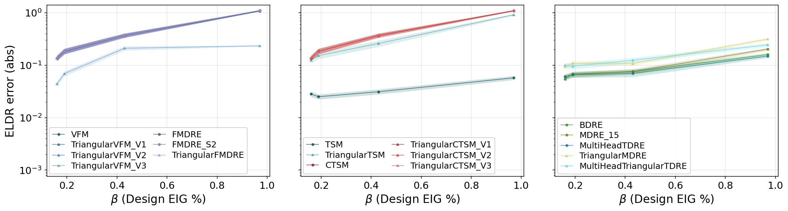
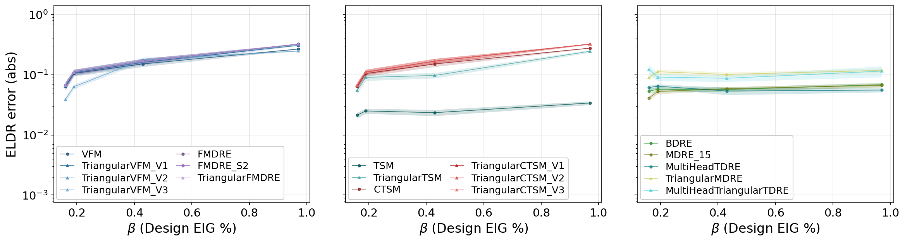
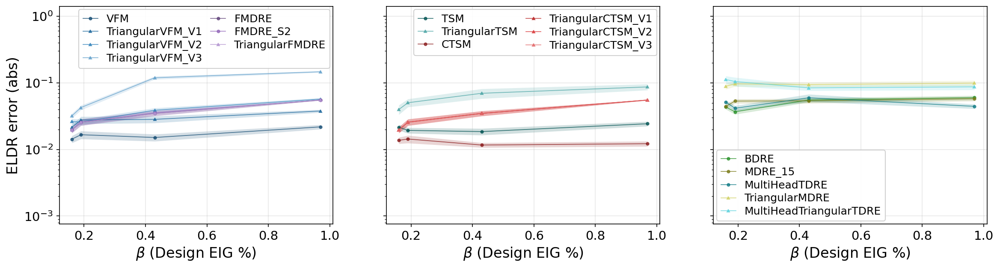
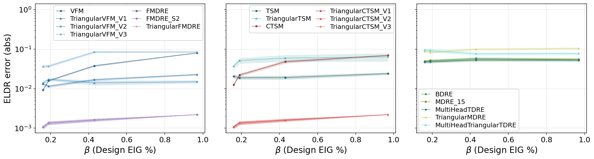

**regret** (lower is better ↓) -- per-cell min-max normalized ELDR error, aggregated per
(beta, alpha) stratum as the median-of-medians (median over priors, then over designs)
with a bootstrapped 25/75 IQR band:
`reg[m,c] = (err[m,c] - min_{m'} err[m',c]) / (max_{m'} err[m',c] - min_{m'} err[m',c])`
(`ex/synth/elbo/step3_process_results.py:207-217`, aggregation `:229-235`). stored at
`ex/synth/elbo/figures/elbo_regret_mom_alpha_{0p1,0p3,0p6,0p9}.png` (+ `.pdf` each).

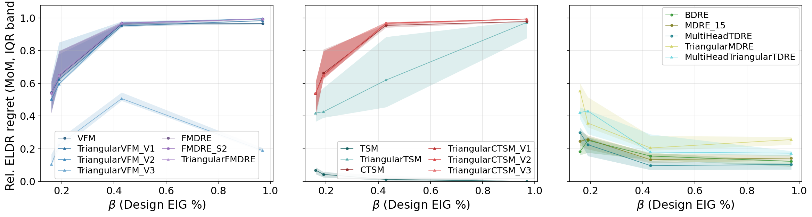
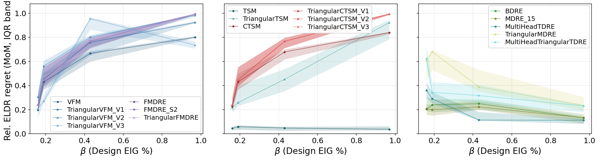
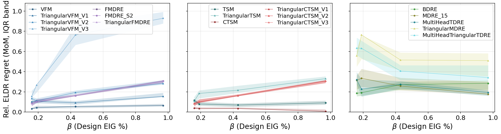
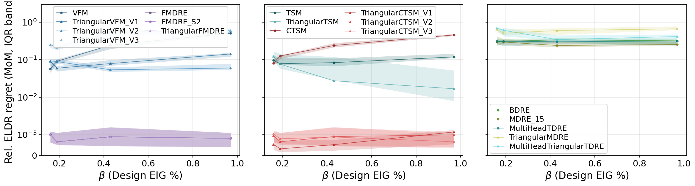

**pointwise MAE** -- not available for elbo: the campaign persisted only the integrated
per-cell `est_eldrs` scalar (`ex/synth/elbo/step4_plot_estimation_results.py:125-126`).

no datagen diagnostics exist for elbo (step1 emits no figures).

#### model_selection (`ex/synth/model_selection/`)

gaussian-pair LDR/ELDR estimation swept over KL(p0||p1) in {0.3, 1, 3, 9, 18, 36, 54} (10
instances each = 70 cells), evaluated on four held-out p* test sets (p* = p0, p1, q0, q1)
per cell. four `nsamples_test` variants (2048/4096/8192/16384 at fixed
`nsamples_train = 8192`) separate MC evaluation noise from estimator bias; the featured
variant below is `tr8192_te4096`, the other three variant directories are listed at the end.

**ELDR error** (lower is better ↓) -- absolute error against the analytic population ELDR
(closed form for gaussians, zero MC noise in the truth), mean +- SE over the 10 instances
within each (KL, p*) stratum: `err[i,t] = |mean_x \hat{r}(x) - ELDR_analytic[i,t]|`
(`ex/synth/model_selection/step3_process_results.py:80-82`). stored at
`ex/synth/model_selection/figures/tr8192_te4096/model_selection_eldr_err_grid.png` (+ `.pdf`).

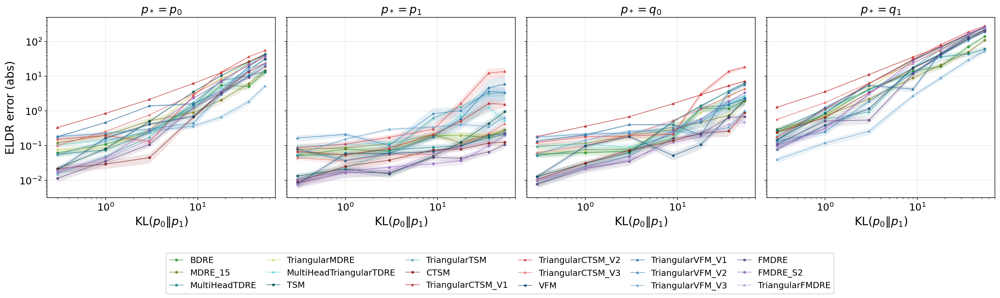

**regret** (lower is better ↓) -- per-(instance, test-set) min-max normalized ELDR error;
per (KL, p*) stratum the point is the median over the 10 instances, the band the
symmetric +/- bootstrap std of that median (500 resamples; an SE-style band, not an IQR):
`reg[m,c] = (err[m,c] - min_{m'} err[m',c]) / (max_{m'} err[m',c] -
min_{m'} err[m',c])` (`ex/synth/model_selection/step3_process_results.py:97-107`,
aggregation `:113-116`). stored at
`ex/synth/model_selection/figures/tr8192_te4096/model_selection_regret_grid.png` (+ `.pdf`).

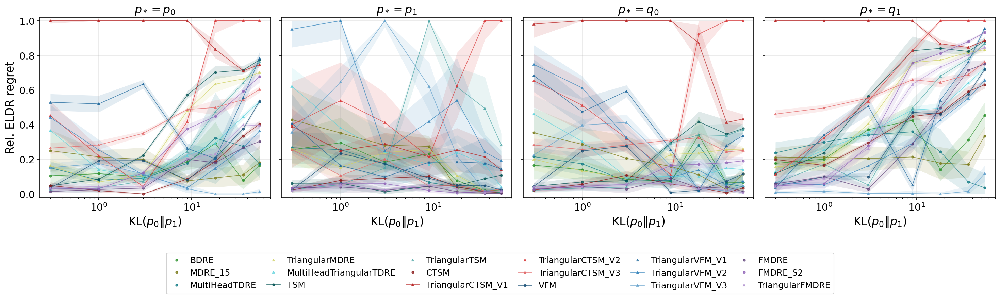

**pointwise MAE** (lower is better ↓) -- mean absolute per-sample LDR error over each
held-out test set, then mean +- SE over the 10 instances within each (KL, p*) stratum:
`mae[i,t] = mean_j |\hat{r}(x_j) - r_true(x_j)|`
(`ex/synth/model_selection/step3_process_results.py:148`, aggregation
`ex/synth/model_selection/step4_plot_results.py:143-144`). stored at
`ex/synth/model_selection/figures/tr8192_te4096/model_selection_pointwise_mae_grid.png` (+ `.pdf`).

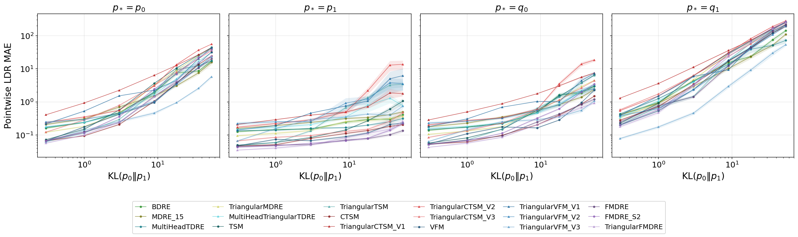

other variants (same three plots each):
`ex/synth/model_selection/figures/tr8192_te2048/`, `.../tr8192_te8192/`,
`.../tr8192_te16384/`. the variant comparison (ELDR error vs `nsamples_test`, log-log;
evaluation MC noise falls ~ `1/sqrt(n_test)` while estimator bias plateaus) is plotted by
`ex/synth/model_selection/step5_compare_variants.py:224` into
`ex/synth/model_selection/figures/compare/compare_variants_{p0,p1,mid,dist,legend}.png`.

no datagen diagnostics exist for model_selection (step1 emits no figures).

#### occupancy (`ex/synth/occupancy/`)

LDR/ELDR estimation on SMODICE-style discounted state-action occupancy distributions of a
16x16 stochastic gridworld: p0 = anti-goal occupancy d_O, p1 = expert occupancy d_E, p* =
the beta = 0.5 mixture, encoded into R^6 via `gaussian_blob` (sigma = 0.2). hardness is the
prescribed KL1 = KL(d_O||d_E) in {0.4, 0.8, 1.6, 3.2}; 40 seeds per cell in the gathered
campaign (configs stage 100 for future runs), 5000 samples/cell. each box below is the raw
distribution over the 40 seeds within one KL1 stratum -- median line, IQR box, whisker
tails (box emitter `ex/utils/family_boxplot.py:150`).

**ELDR error** (lower is better ↓) -- per-cell absolute error of the mean estimate against
the stored exact integrated ELDR: `eldr_err = |mean_x \hat{r}(x) - integrated_eldr_true|`
(`ex/synth/occupancy/step3_process_results.py:158`; truth loaded `:143-146`); one box = the
per-seed values within one KL1 stratum. stored at
`ex/synth/occupancy/figures/occupancy_eldr_err_boxplot.png` (+ `.pdf`).

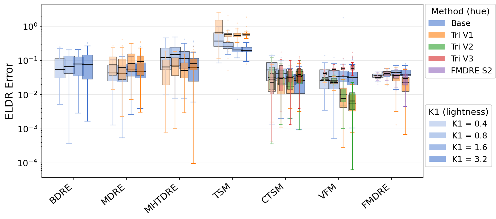

**regret** (lower is better ↓) -- per-(KL1, seed) min-max normalized ELDR error across
methods: `reg[m,c] = (eldr_err[m,c] - min_{m'} eldr_err[m',c]) / (max_{m'} eldr_err[m',c] -
min_{m'} eldr_err[m',c])` (`ex/synth/occupancy/step3_process_results.py:218-226`); one box =
the per-seed values within one KL1 stratum. stored at
`ex/synth/occupancy/figures/occupancy_regret_boxplot.png` (+ `.pdf`).

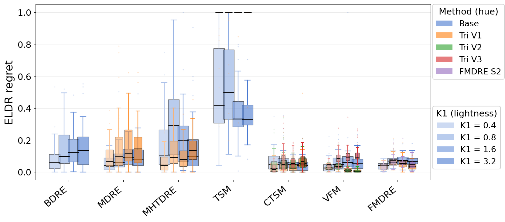

**pointwise MAE** (lower is better ↓) -- per-cell mean absolute LDR error over the 5000 p*
samples against the exact tabular (smoothed) occupancy LDR:
`mae = mean_x |\hat{r}(x) - r_true_smoothed(x)|`
(`ex/synth/occupancy/step3_process_results.py:157`); one box = the per-seed values within
one KL1 stratum. stored at
`ex/synth/occupancy/figures/occupancy_pointwise_mae_boxplot.png` (+ `.pdf`).

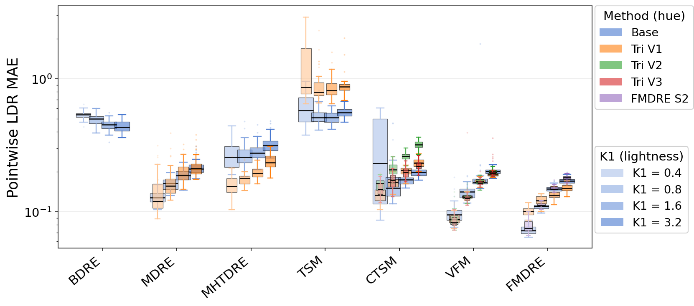

datagen diagnostics (`ex/synth/occupancy/diagnostic_datagen.py`):

- combined datagen diagnostic (prescribed-vs-realized KL1, beta vs realized KL2,
  discrete-vs-smoothed LDR hexbin, per-cell LDR histograms, PCA panel; savefig `:649-650`):
  `ex/synth/occupancy/figures/datagen_diagnostic_gaussian_blob.png`

  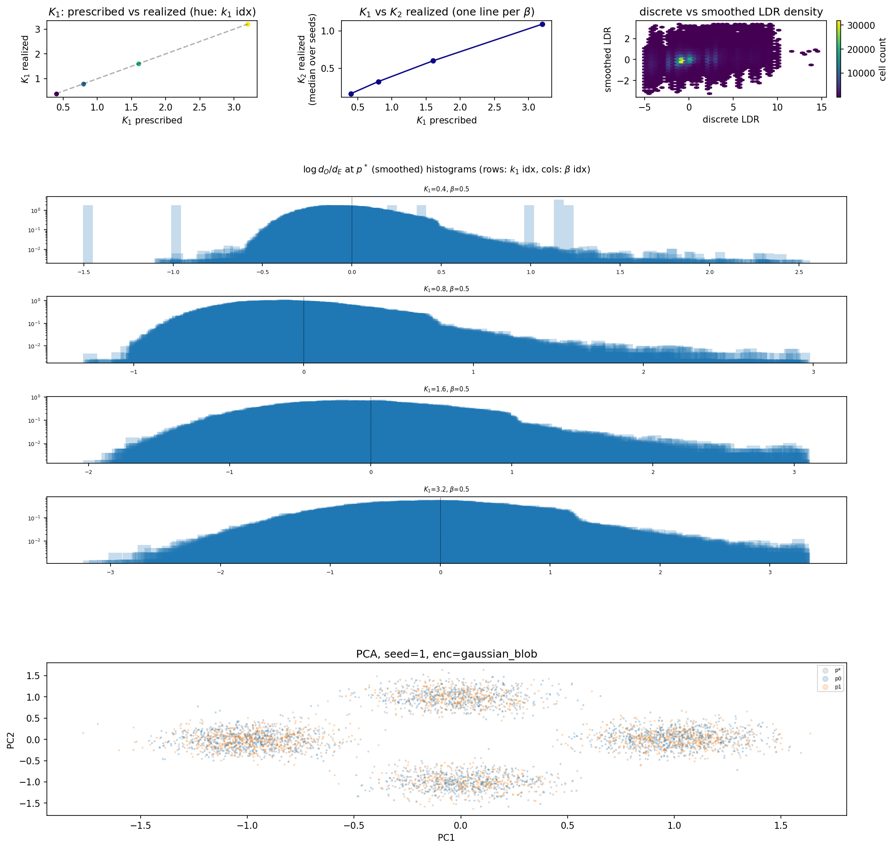

- hardness boxplot grid (`inv_kl_O_E`, `ldr_std`, `latent_mean_dist`, ...; savefig
  `:700-701`): `ex/synth/occupancy/figures/datagen_variance_gaussian_blob.png`

  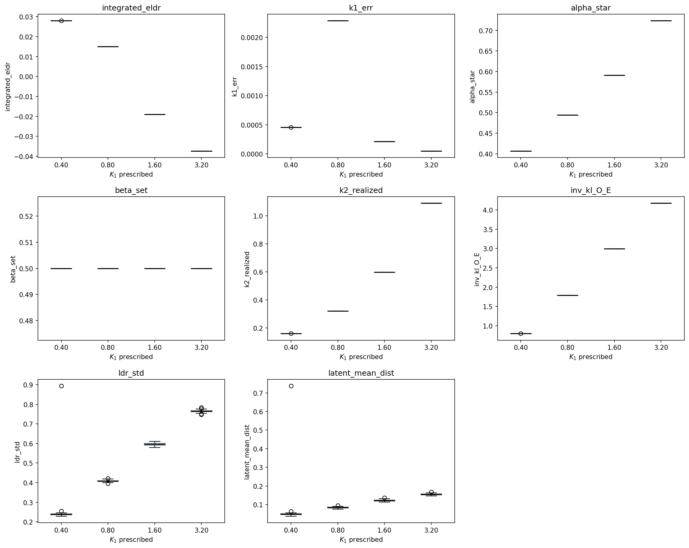

- per-stratum data card (`twonn_id`, `part_ratio`, `eff_modes_dpi`, `occ_components`,
  `lip_q90`, `hill_tail`; written `:116-121` via `ex/utils/data_card.py:230`):
  `ex/synth/occupancy/figures/data_card_gaussian_blob.png` (+ `.pdf`, `.md`, `.tex`)

  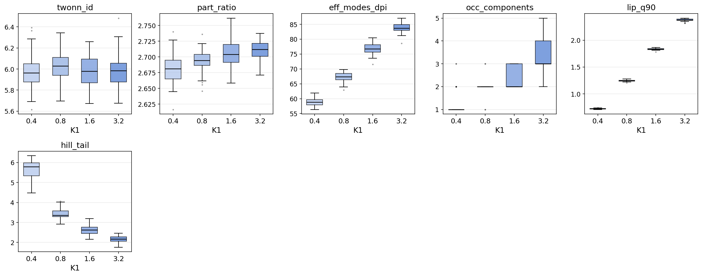

- ground-truth renderings (state-occupancy heatmap + sampled action arrows for
  p0/p1/p*, 2 seeds, one file per KL1; savefig `:164-166`):
  `ex/synth/occupancy/figures/datagen_samples_gaussian_blob_k1_{0.4,0.8,1.6,3.2}.png` (+ `.pdf` each)

  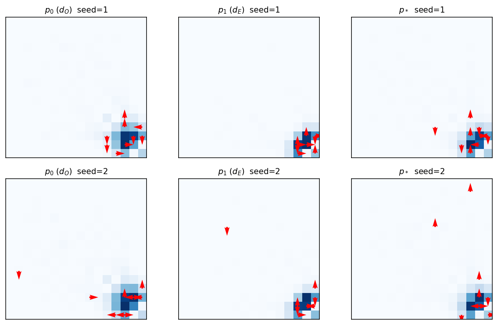
  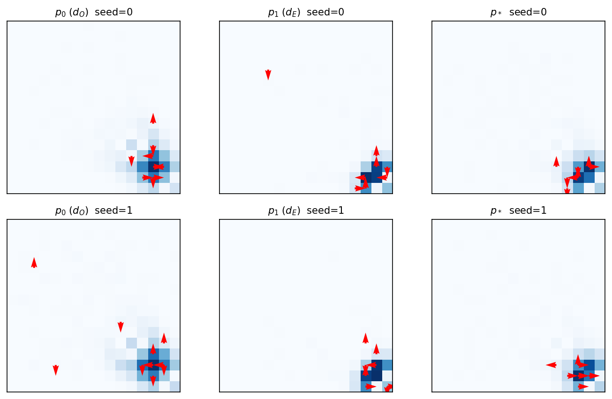
  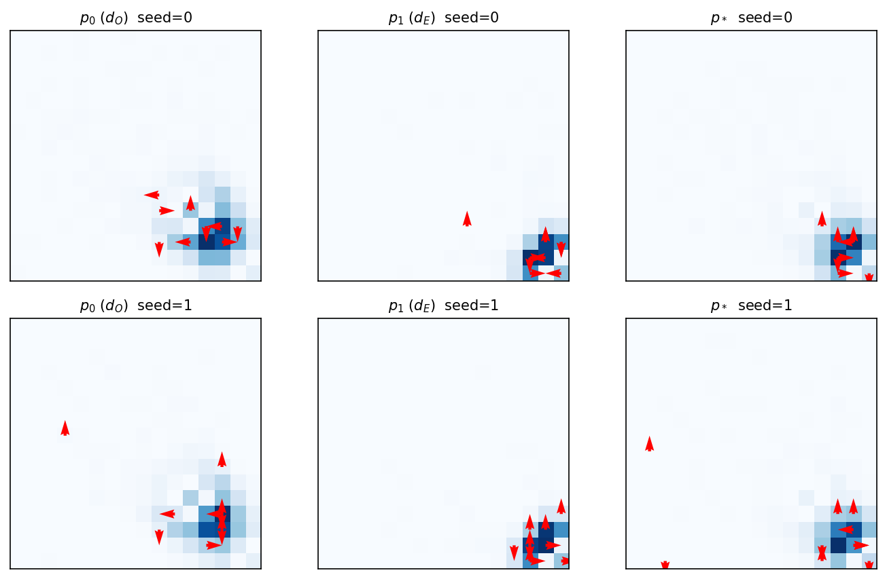
  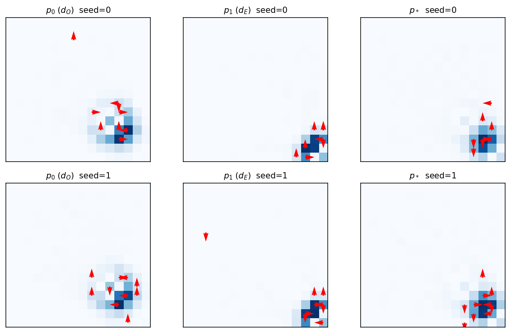

### semi-synthetic benchmarks (ex/semisynth)

all four experiments share one metric implementation
(`ex/utils/semisynth_metrics.py::compute_metrics`) and one plot emitter
(`ex/utils/family_boxplot.py:149-151`; tables `:154-155`). per cell (one
(hardness-stratum, pair/seed) combination):

- **ELDR abs error** (lower is better ↓; `ex/utils/semisynth_metrics.py:80`):
  `eldr_abs_err[m,c] = |mean_x \hat{r}_m(x) - mean_{x'} r_true(x')|` -- absolute
  difference of two means (estimate eval set vs ground-truth eval set; the sets differ
  per experiment, see quirks below).
- **pointwise MAE** (lower is better ↓; `ex/utils/semisynth_metrics.py:92`):
  `mae[m,c] = (1/L) \sum_j |\hat{r}_m(x_j) - r_true(x_j)|` over pointwise-aligned samples.
- **regret** (lower is better ↓; `ex/utils/semisynth_metrics.py:98,110-119`):
  `regret[m,c] = (eldr_abs_err[m,c] - min_{m'} eldr_abs_err[m',c]) /
  (max_{m'} eldr_abs_err[m',c] - min_{m'} eldr_abs_err[m',c])` -- built on ELDR error,
  tie -> 0, <2 finite methods -> NaN.

boxes are never averaged over cells: each box is the raw distribution over the ~40
pairs/seeds within one hardness stratum -- median line, IQR box, whisker tails (hue =
method family, box lightness = hardness).

#### dbpedia (`ex/semisynth/dbpedia/`)

DBpedia-14 text benchmark: SBERT `all-mpnet-base-v2` embeddings -> PCA(64) -> shared
class-conditional flow; per cell two dirichlet-drawn class-mixture weight vectors define p0
and p1 analytically (logsumexp over class flows), p* is the balanced mixture. alpha in
{0.1, 0.3, 0.9, 2.7} x 40 pairs = 160 cells, 18 methods, 5000 samples per distribution.
eval quirk: MAE uses the 5000 train p* points; ELDR error compares against the mean over
100000 fresh flow-sampled points (`samples_test_true_ldrs`).

**ELDR error** (lower is better ↓) -- stored at `ex/semisynth/dbpedia/figures/dbpedia_eldr_abs_err_boxplot.png` (+ `.pdf`).

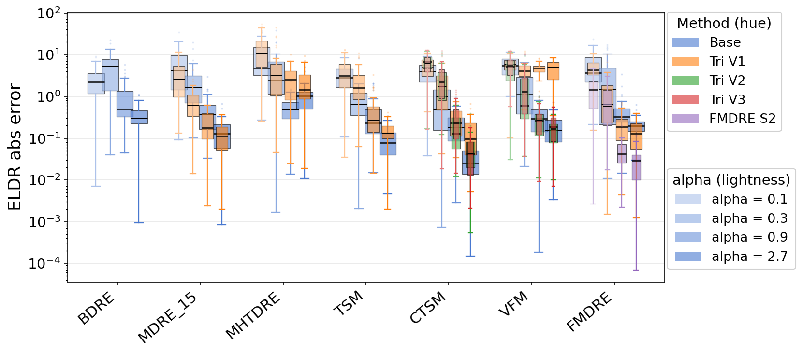

**regret** (lower is better ↓) -- stored at `ex/semisynth/dbpedia/figures/dbpedia_regret_boxplot.png` (+ `.pdf`).

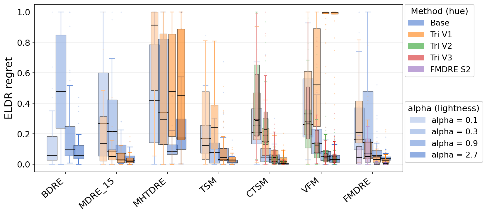

**pointwise MAE** (lower is better ↓; train p*) -- stored at `ex/semisynth/dbpedia/figures/dbpedia_mae_train_boxplot.png` (+ `.pdf`).

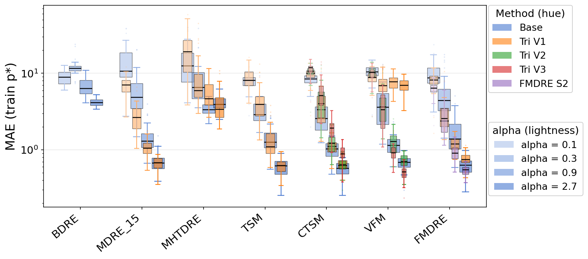

datagen diagnostics (`ex/semisynth/dbpedia/diagnostic_datagen.py`):

- summary diagnostic (LDR histograms, KL scatter, LDR stats; emitter
  `ex/utils/diagnostics.py:184-185`): `ex/semisynth/dbpedia/figures/datagen_diagnostic_summary.png`

  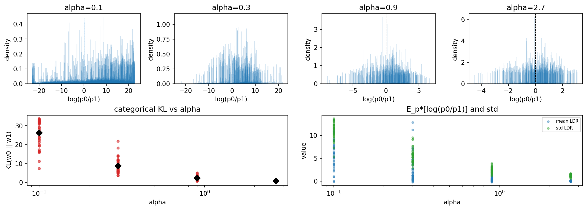

- hardness boxplots (K = 14; `ex/utils/diagnostics.py:365`):
  `ex/semisynth/dbpedia/figures/datagen_variance.png`

  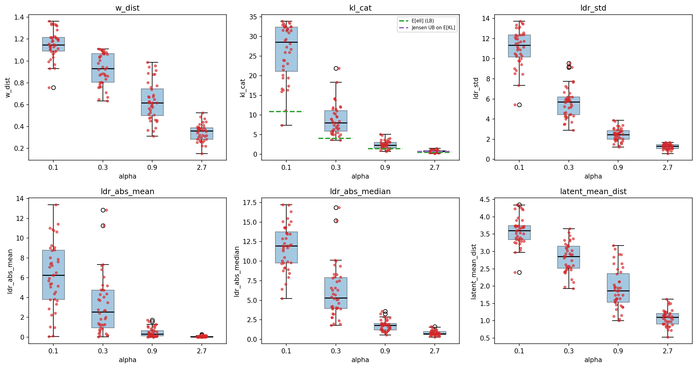

- per-stratum data card (`twonn_id`, `part_ratio`, `mean_cos`, `hubness`, `gmm_modes`,
  `eff_modes_w0/w1`, `lip_q90`, `hill_tail`; `diagnostic_datagen.py:341-369`):
  `ex/semisynth/dbpedia/figures/data_card.png` (+ `.pdf`, `.md`, `.tex`)

  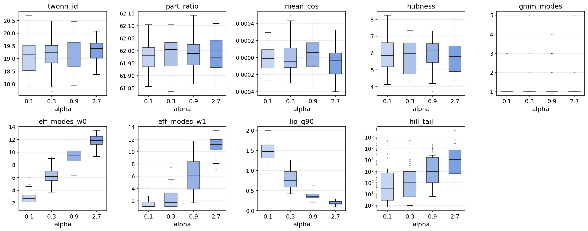

- ground-truth renderings (exact class-mixture weight bars -- dbpedia has no decoder, so
  the mixture composition is the human-viewable ground truth; `diagnostic_datagen.py:372-403`):
  `ex/semisynth/dbpedia/figures/datagen_gt_weights_alpha_{0p1,0p3,0p9,2p7}.png` (+ `.pdf` each)

  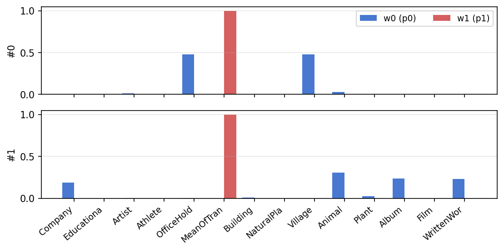
  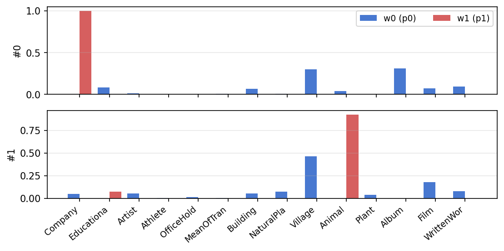
  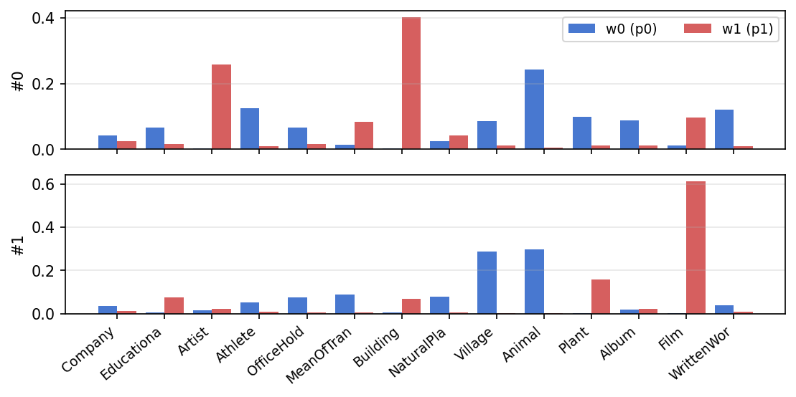
  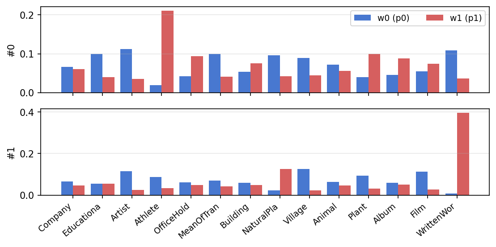

- per-pair panels (class-target bars and PCA, chunked 10 pairs per file):
  `ex/semisynth/dbpedia/figures/datagen_diagnostic_{weights,pca}_p{00-09,10-19,20-29,30-39}.png`

#### mnist (`ex/semisynth/mnist/`)

MNIST benchmark in a 14-d VAE latent space with a shared class-conditional flow; per cell
two dirichlet class-weight vectors define p0/p1 analytically, p* is the balanced mixture.
alpha in {0.1, 0.3, 0.9, 2.7} x 40 pairs = 160 cells, 18 methods. eval quirk: unlike
dbpedia/pendulum, BOTH metrics evaluate on the 40000 held-out flow-sampled test points
(`ex/semisynth/mnist/step3_process_results.py:60-63` passes
`mae_gt_key = eldr_gt_key = 'samples_test_true_ldrs'`), so the MAE ylabel reads
"held-out test p*".

**ELDR error** (lower is better ↓) -- stored at `ex/semisynth/mnist/figures/mnist_eldr_abs_err_boxplot.png` (+ `.pdf`).

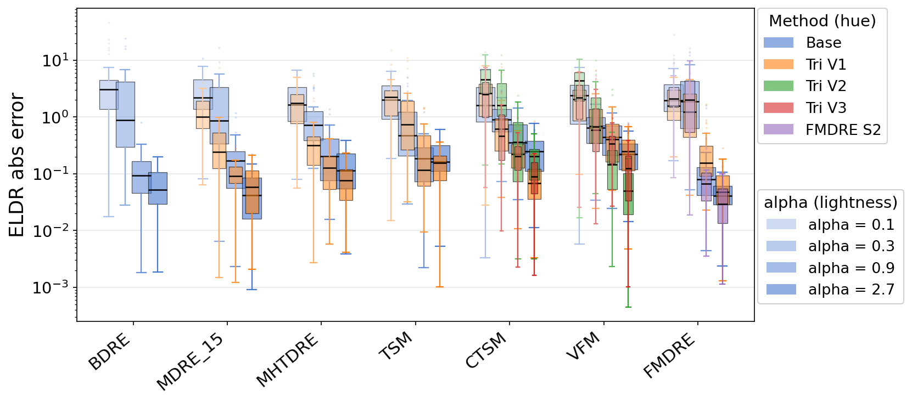

**regret** (lower is better ↓) -- stored at `ex/semisynth/mnist/figures/mnist_regret_boxplot.png` (+ `.pdf`).

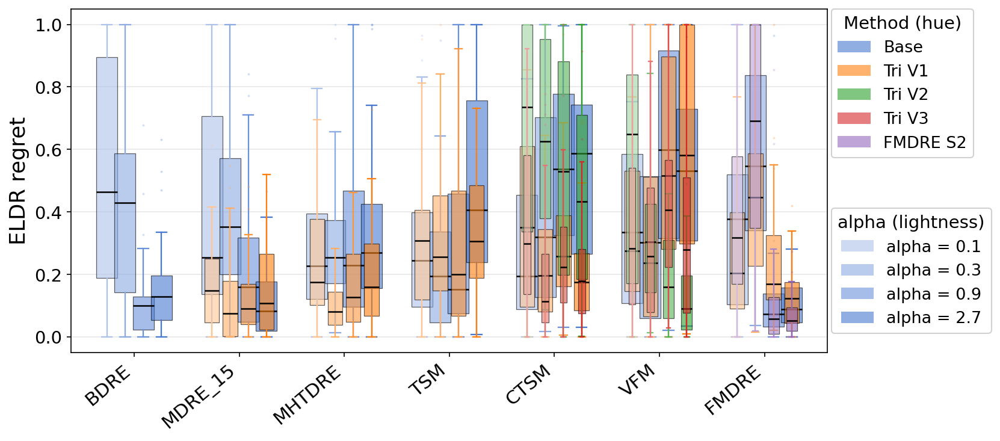

**pointwise MAE** (lower is better ↓; held-out test p*) -- stored at
`ex/semisynth/mnist/figures/mnist_mae_train_boxplot.png` (+ `.pdf`; the h5 key is
historically named `mae_train` but the values are held-out).

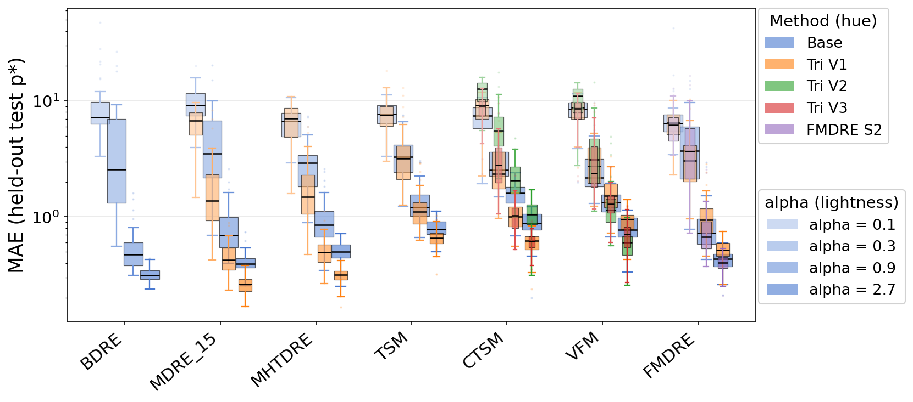

datagen diagnostics (`ex/semisynth/mnist/diagnostic_datagen.py`):

- summary diagnostic: `ex/semisynth/mnist/figures/datagen_diagnostic_summary.png`

  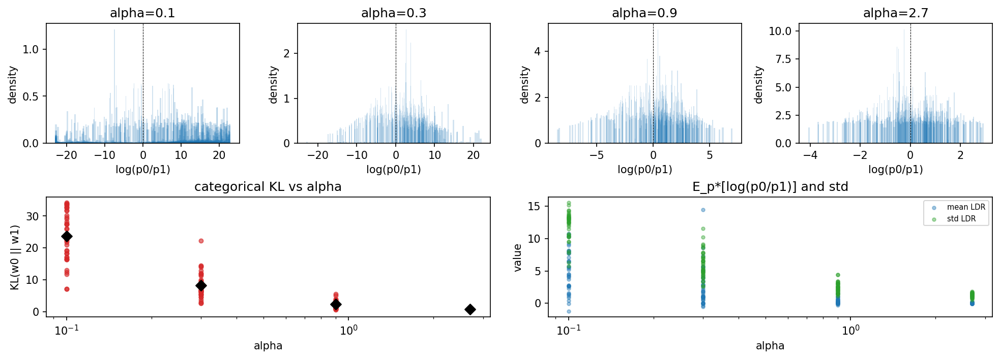

- hardness boxplots (K = 10): `ex/semisynth/mnist/figures/datagen_variance.png`

  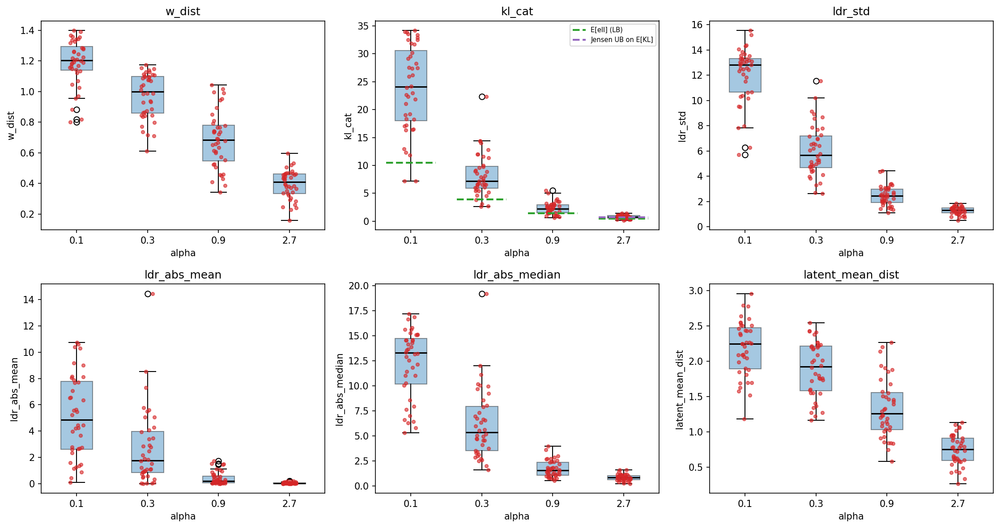

- per-stratum data card (`diagnostic_datagen.py:313-340`):
  `ex/semisynth/mnist/figures/data_card.png` (+ `.pdf`, `.md`, `.tex`)

  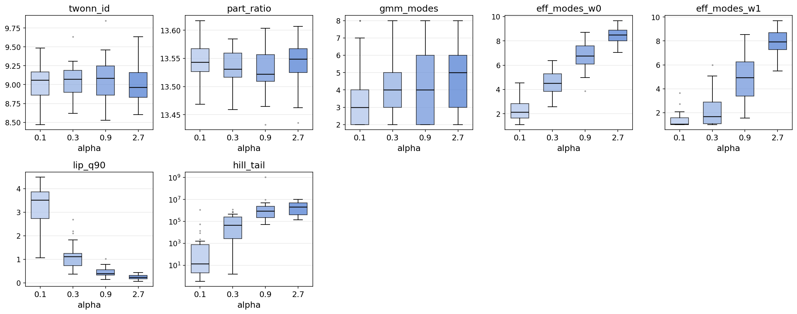

- ground-truth renderings (VAE-decoded 28x28 digits, 10 per distribution p0/p1/p* for 2
  pairs per alpha; `diagnostic_datagen.py:342-385`):
  `ex/semisynth/mnist/figures/datagen_samples_alpha_{0p1,0p3,0p9,2p7}.png` (+ `.pdf` each)

  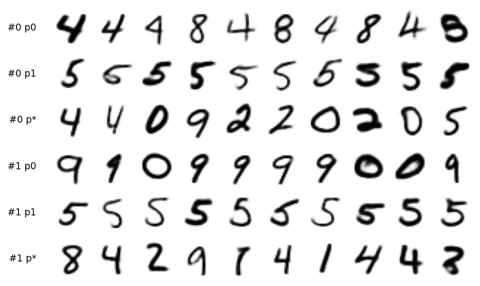
  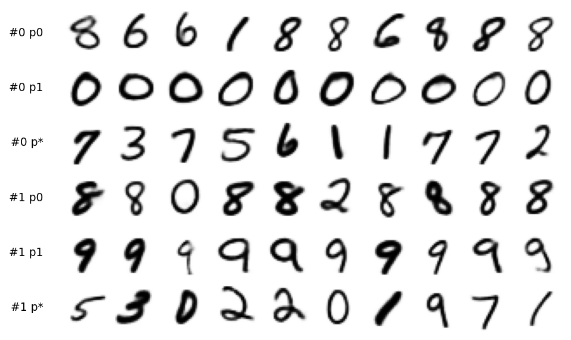
  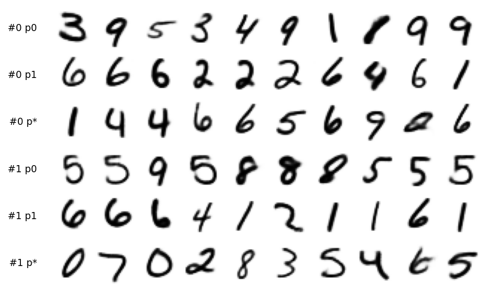
  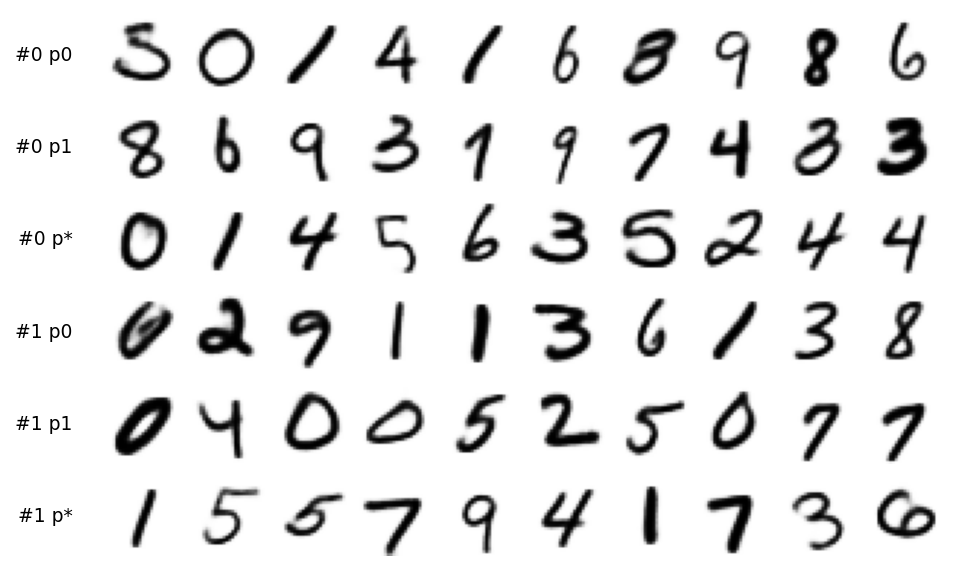

- per-pair panels: `ex/semisynth/mnist/figures/datagen_diagnostic_{weights,counts,pca}_p{00-09,...,30-39}.png`

#### mnist_uncond (`ex/semisynth/mnist_uncond/`)

unconditional-flow MNIST variant: each (alpha, pair) cell trains its own per-pair VAE +
unconditional flows for p0/p1, with a change-of-variables (log|det J|) correction into the
global VAE latent space. **no gathered results exist** -- `raw_results/` and
`processed_results/` are empty, so step4 cannot run and the three metric figures are
pending at `ex/semisynth/mnist_uncond/figures/mnist_uncond_{regret,eldr_abs_err,mae_train}_boxplot.png`.
also note `config.yaml` now declares 3 alphas `[2.0, 4.0, 8.0]` while the on-disk datagen
cells are the older 4-alpha grid. stale april-vintage diagnostics (pre-refactor layout, not
embedded): `ex/semisynth/mnist_uncond/figures/{datagen_diagnostic,datagen_kl_diagnostic,datagen_variance,pretrain_diagnostic}.png`.
no data card or gt renderings are implemented for this variant.

#### pendulum (`ex/semisynth/pendulum/`)

trajectory-level ELDR on the pendulum environment: p0 = pi_O (suboptimal blended gaussian
policy over a tile-coded Q), p1 = pi_E (expert upright policy), p* = the 0.5 policy
mixture; each sample is a flattened 6-step (theta, theta_dot, action) rollout (18-d).
hardness is the prescribed trajectory-level K1 = KL(pi_O||pi_E) in {4, 12, 36} x 40 seeds
= 120 cells. eval quirk: MAE uses the 5000 train p* trajectories; the ELDR truth is
computed analytically (no flow) over 100000 fresh mixture rollouts via exact policy
log-densities (`ex/semisynth/pendulum/append_test_set.py:186-193`).

**ELDR error** (lower is better ↓) -- stored at `ex/semisynth/pendulum/figures/pendulum_eldr_abs_err_boxplot.png` (+ `.pdf`).

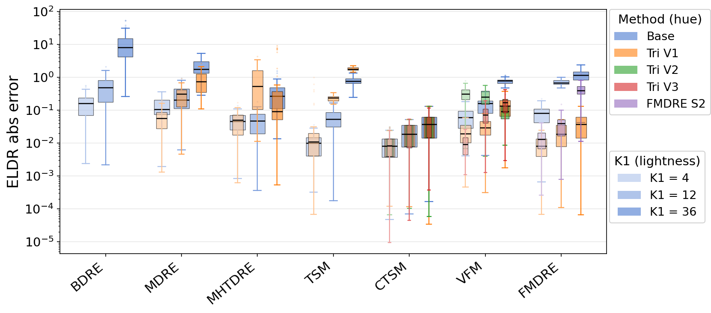

**regret** (lower is better ↓) -- stored at `ex/semisynth/pendulum/figures/pendulum_regret_boxplot.png` (+ `.pdf`).

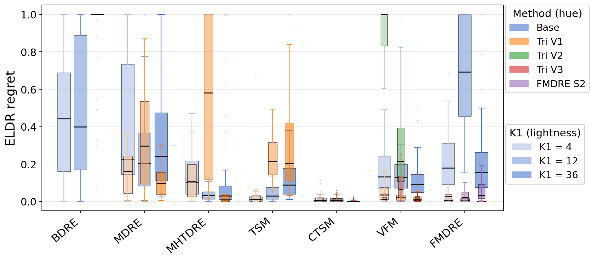

**pointwise MAE** (lower is better ↓; train p*) -- stored at
`ex/semisynth/pendulum/figures/pendulum_mae_train_boxplot.png` (+ `.pdf`).

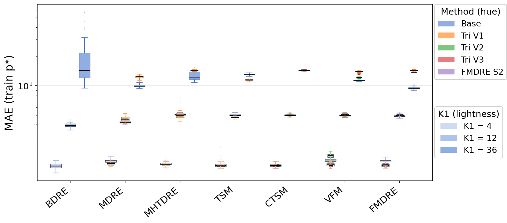

datagen diagnostics (`ex/semisynth/pendulum/diagnostic_datagen.py`):

- composite datagen diagnostic (prescribed-vs-realized K1, beta vs realized K2, bellman
  residuals, LDR histograms, phase-space grid, PCA; savefig `:665-666`):
  `ex/semisynth/pendulum/figures/datagen_diagnostic.png`

  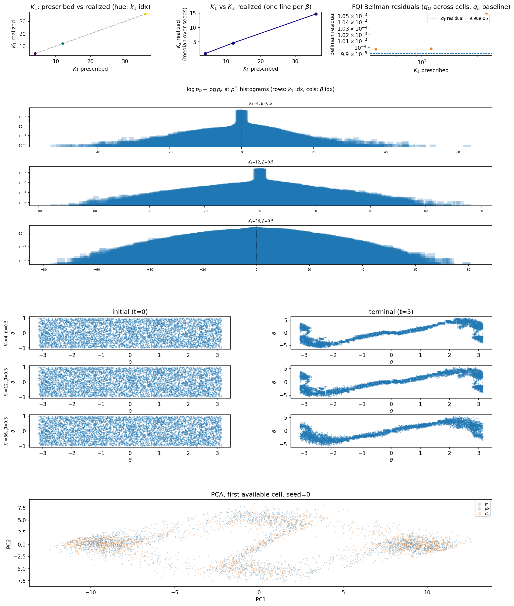

- hardness boxplots (+ `KL_O_E`, `KL_E_mix`, `mc_se`, `q_O_residual`; savefig `:527`):
  `ex/semisynth/pendulum/figures/datagen_variance.png`

  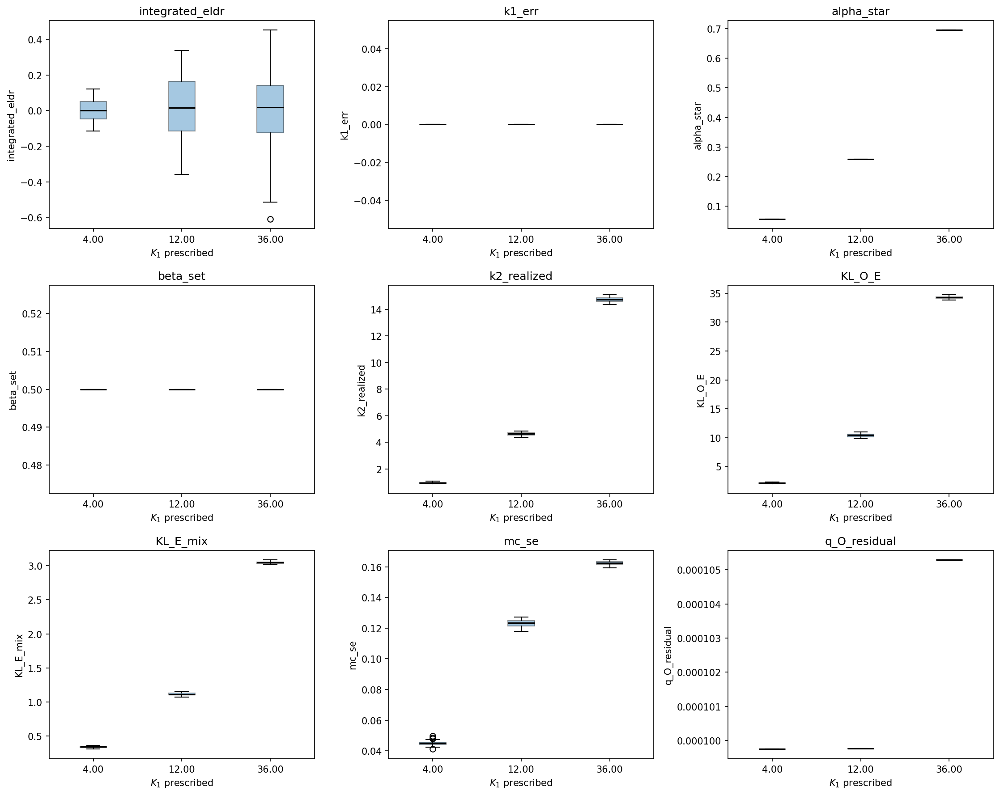

- per-K1 data card (`diagnostic_datagen.py:71-96`):
  `ex/semisynth/pendulum/figures/data_card.png` (+ `.pdf`, `.md`, `.tex`)

  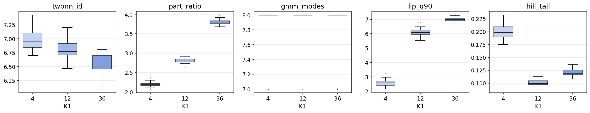

- ground-truth renderings (10 phase-space (theta, theta_dot) rollouts per distribution
  pi_O/pi_E/p* x 2 seeds per K1; savefig `:134`):
  `ex/semisynth/pendulum/figures/datagen_samples_k1_{4,12,36}.png` (+ `.pdf` each)

  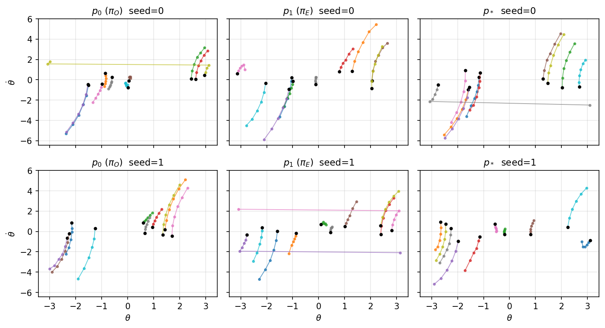
  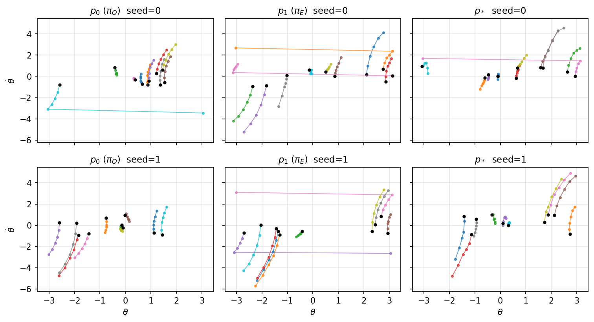
  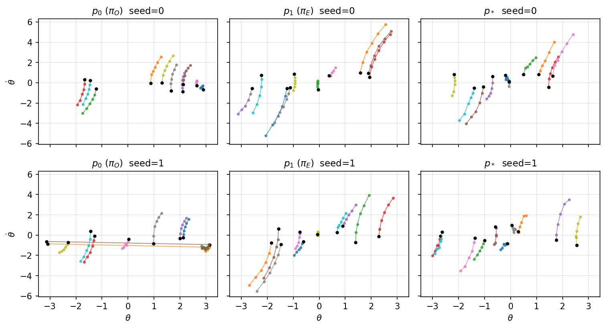

### dokls ablation (`ex/ablations/dokls/`)

"difference of KLs": does an anchored two-leg LDR estimator match a direct one on the
same ELDR target? the two-leg route trains two critics on shared anchor samples -- leg0
fits `log(p*/p0)`, leg1 fits `log(p*/p1)` (`ex/ablations/dokls/two_leg.py:105-106`) -- and
recovers `log(p0/p1) = log(p*/p1) - log(p*/p0)` by subtraction (`two_leg.py:142`); the
direct route trains a single critic on (p0, p1) pairs (`two_leg.py:227`). benchmark: 70
gaussian cells (7 KL levels x 10 instances, d = 3) with analytic ELDR truth, anchors q0 =
midpoint gaussian and q1 = distant gaussian, N in {1024, 2048, 4096, 8192}, 10
method/loss variants. caveats: the ablation's own direct arm has not been run -- the
"direct" comparator in the `cmp` figures is a snapshot of the model_selection direct
experiment (`ex/ablations/dokls/ms_ref/tr8192_te8192.h5`) overlaid only at the matched
cells; and some images on disk slightly predate the last edit of their plotting scripts.

eight figure families per metric, all under `ex/ablations/dokls/figures/` as `.png` +
`.pdf` pairs. rows of every grid = anchor p* in {q0, q1}; "diagonal" sweeps N_* = N
jointly, "decoupled" pins the fit budget N = 8192 and sweeps the p* eval budget N_* in
{2048, 4096, 8192}:

- `dokls_cmp_*` -- diagonal, x = N, panels = KL; model_selection direct overlaid at the
  matched N = 8192 point (`plot_compare.py`).
- `dokls_cmp_vsNstar_*` -- decoupled, x = N_*, panels = KL; MS overlay (`plot_vs_nstar.py`).
- `dokls_cmp_vsKL_*` -- decoupled common cells, x = KL, panels = N_*; MS overlay
  (`plot_vs_kl_common.py`).
- `dokls_vsN_*` -- diagonal, x = N, panels = KL; MS direct circles at N = 8192 except on
  the regret panel (the snapshot lacks `regret_*` keys) (`plot_vs_N.py`).
- `dokls_diag_vsN_*` -- diagonal, dokls only, x = N, panels = KL (`plot_dokls_only.py`).
- `dokls_dec_vsNstar_*` -- decoupled, dokls only, x = N_*, panels = KL (`plot_dokls_only.py`).
- `dokls_dec_vsKL_*` -- decoupled, dokls only, x = KL, panels = N_* (`plot_dokls_only.py`).
- `dokls_*_grid` -- diagonal, dokls only, x = KL, one panel per (p*, N)
  (`step4_plot_results.py`; the only family with error bands and table sidecars).

**ELDR error** (lower is better ↓) -- absolute ELDR error vs the analytic truth, mean +-
SE over the 10 instances within each KL stratum:
`eldr_err[k] = (1/10) \sum_j |\hat{ELDR}_{k,j} - ELDR_true_{k,j}|` with
`\hat{ELDR}_c = mean_i \hat{r}_c(x_i)` over the N_* anchor samples
(`ex/ablations/dokls/step3_process_results.py:66` for the estimate, `:93-95` for the
error +- SE; the band is drawn only in the `grid` family).

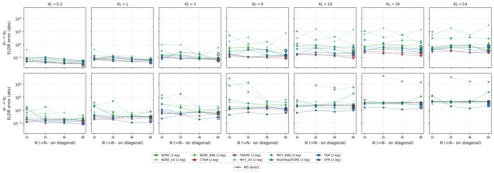


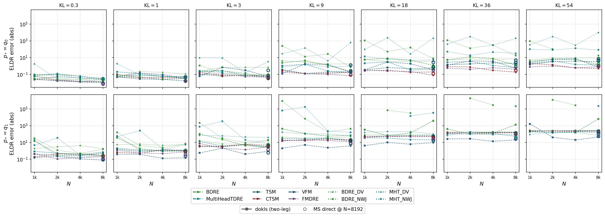


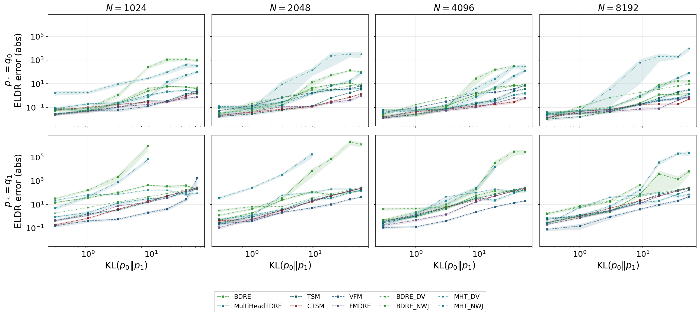

**regret** (lower is better ↓) -- two distinct definitions. the
`cmp`/`cmp_vsNstar`/`cmp_vsKL` figures min-max normalize the per-KL mean ELDR error at
plot time over whichever series are present at each x-point (10 dokls series + the 6
model_selection series on their cells; `ex/ablations/dokls/plot_compare.py:60-75`,
pooling `:143-151`). the `vsN`/`diag`/`dec`/`grid` figures use the stored per-cell regret
`regret[m,c] = (err[m,c] - min_{m'} err[m',c]) / (max_{m'} err[m',c] - min_{m'} err[m',c])`
aggregated per KL stratum as the median over the 10 instances with a symmetric +-
bootstrap-std-of-median band (an SE-style band, not an IQR;
`ex/ablations/dokls/step3_process_results.py:111-142`; band drawn only in the `grid`
family).

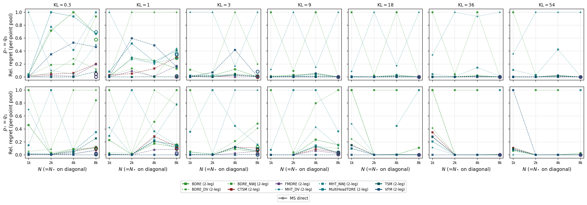


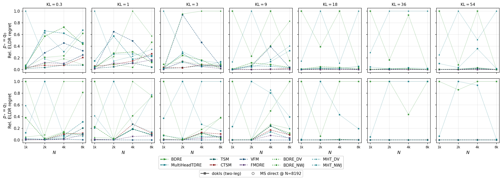


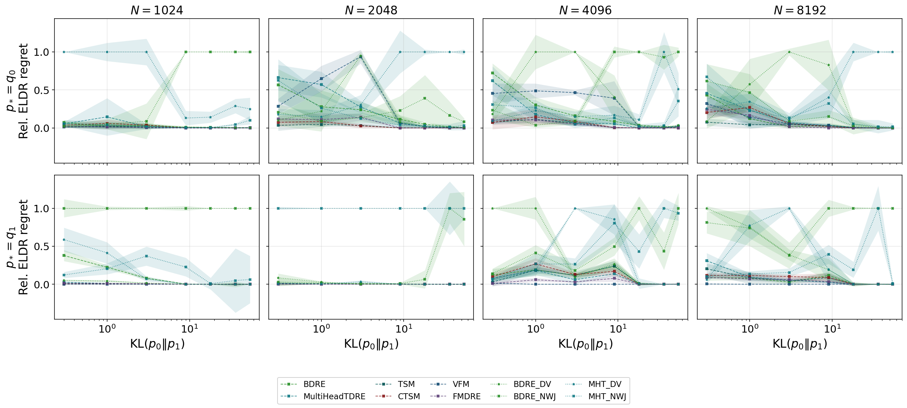

**pointwise MAE** (lower is better ↓) -- per-cell mean absolute LDR error over the N_*
anchor samples, then mean over the 10 instances within each KL stratum:
`mae[k] = (1/10) \sum_j (1/N_*) \sum_i |\hat{r}_{k,j}(x_i) - r_true_{k,j}(x_i)|`
(`ex/ablations/dokls/step3_process_results.py:72-73`, aggregation `:97`).

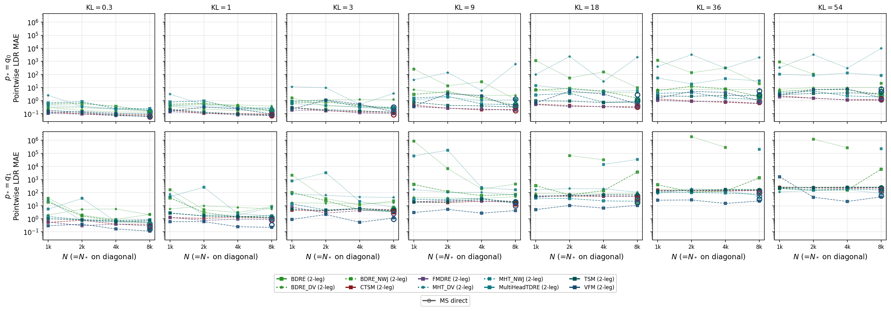


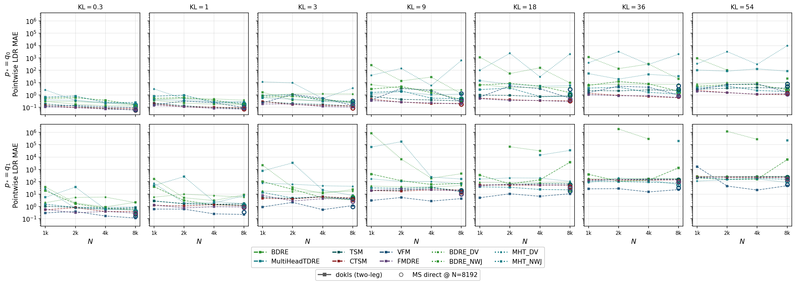


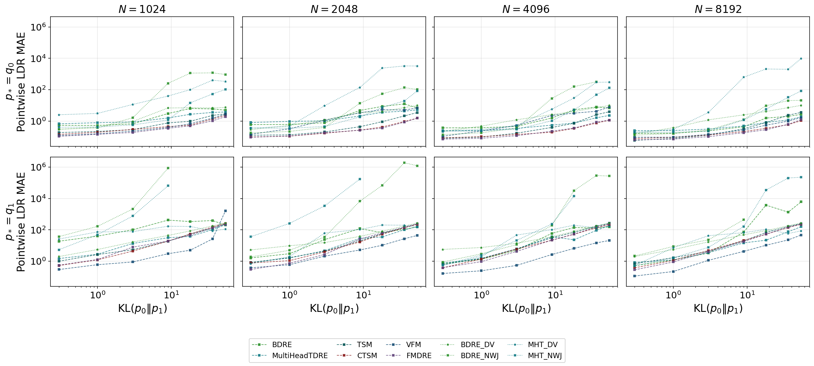

secondary bias/variance decompositions (grid family only):

**signed bias** (closer to 0 is better) -- `bias[k] = mean_j(\hat{ELDR}_{k,j} -
ELDR_true_{k,j})`, mean +- SE over the 10 instances within each KL stratum
(`ex/ablations/dokls/step3_process_results.py:82-83`).

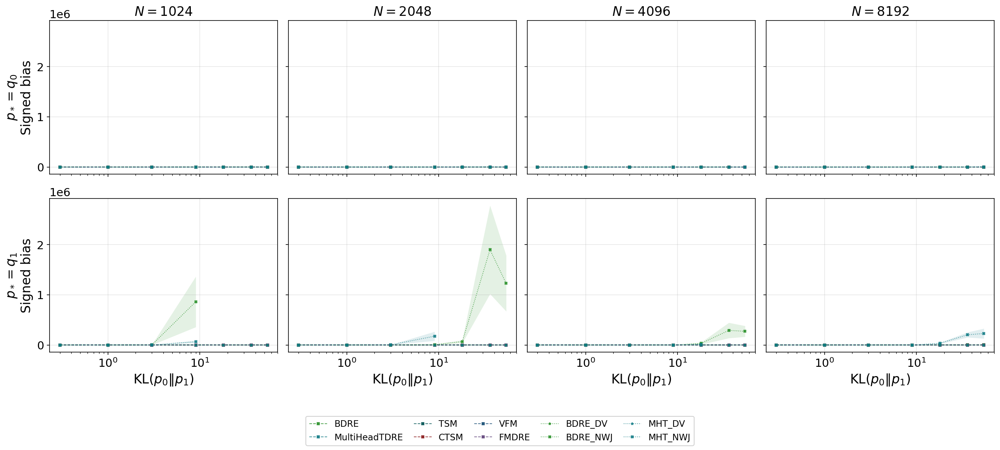

**variance** (lower is better ↓) -- across-instance variance of the signed error within
each KL stratum, `var[k] = Var_j(\hat{ELDR} - ELDR)`, +- SE
(`ex/ablations/dokls/step3_process_results.py:85-89`).

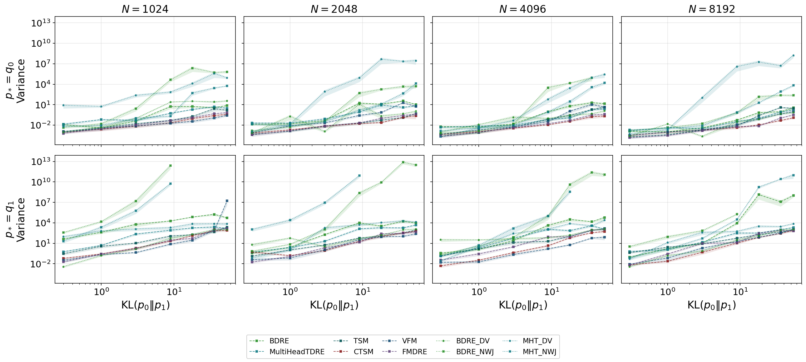

no datagen diagnostics exist for dokls.

## Installation

1. Run `bash setup.sh` from the project root. this creates a `venv/` virtual environment and `pip install`s every direct dependency.
2. Activate it for subsequent shells: `source venv/bin/activate` (or `conda activate fac` if you maintain the project's conda env instead).

dependencies installed by `setup.sh`: `numpy`, `scipy`, `torch`, `matplotlib`, `einops`, `seaborn`, `ipython` (optional, interactive), `tqdm`, `pyyaml`, `h5py`, plus the DBpedia ELDR conditional-flow extras `sentence-transformers`, `datasets`, `scikit-learn`. add `optuna`, `joblib`, and `kaleido` (optional, for plotly PNG export) on top of `setup.sh` if you intend to run the HPO stack:

```bash
pip install optuna joblib kaleido
```

## Environment

a few env vars are read at runtime.

| variable | required by | default | meaning |
| --- | --- | --- | --- |
| `DPE_DATA_ROOT` | Optuna storage, slurm submit | (required, must be set) | nfs-shared root for journal files. studies persist under `$DPE_DATA_ROOT/<experiment>/hpo_optuna/<method>.journal`. |
| `SLURM_ARRAY_TASK_ID` | `ex/utils/hpo/optuna/submit.py` | (set by slurm) | identifies the `(experiment, method)` combo this array element should handle. |
| `OMP_NUM_THREADS`, `MKL_NUM_THREADS`, `OPENBLAS_NUM_THREADS` | Optuna worker | set by `worker.py` to `cores_per_trial` before `torch` import | per-trial BLAS thread budget. set automatically; do not export ahead of time. |
| `DPE_CORES_PER_NODE`, `DPE_MEM_PER_NODE` | `submit.sh` | `16`, `32G` | per-job slurm resource defaults; override via flags or env. |
| `SLURM_PARTITION`, `SLURM_TIME`, `SLURM_CONCURRENCY` | `submit.sh` | `cpu`, `06:00:00`, `16` | per-job slurm allocation; override via flags or env. |

a minimal one-off setup:

```bash
bash setup.sh
source venv/bin/activate
pip install optuna joblib kaleido         # only if using HPO
export DPE_DATA_ROOT=/path/to/nfs/scratch # only if using HPO
```

## Organization

- `src/` - implementations of algorithms, models, and their APIs.
  - `methods/` - density ratio estimators. split into `cls/` (classification-based: BDRE, TDRE family, MDRE, tabular plug-in) and `reg/` (regression / score-based: TSM, CTSM, FMDRE, VFM); shared base classes and the training loop in `common/`.
  - `waypoints/` - waypoint generators for telescoping and triangular methods.
  - `sampling/` - data samplers (gibbs, frozen-flow, tabular, pendulum trajectories).
  - `models/` - neural-network backbones for classifiers, regressors, flows, VAEs.
  - `utils/` - shared utilities (i/o, gridworld, pendulum dynamics, etc.).

- `ex/` - reproducible experiment pipelines, grouped by data regime.
  - `synth/` - synthetic experiments with closed-form ground truth: `eig/`, `elbo/`, `model_selection/`, `occupancy/`.
  - `semisynth/` - semi-synthetic experiments combining real-data components with synthesized distribution structure: `mnist/`, `mnist_uncond/`, `dbpedia/`, `pendulum/`.
  - `ablations/` - secondary studies and analysis tooling: `dre_sample_complexity/`, `pstar_sample_complexity/`, `plugin_dre/`, `dre_hidden_dim_scaling/`, `hidden_dim_scaling/`, `eig_vertex_sweep/`, `analysis/` (cross-experiment aggregation).
  - `utils/hpo/` - the Optuna HPO stack and the per-experiment adapters that drive it (see "HPO" below).
  - `utils/step2_runner/` - distributed post-HPO runner used by some experiments to fan winning hyperparameters across slurm jobs.

## Core Abstractions

**DRE** (`src/methods/common/base.py`)
- `fit(samples_p0, samples_p1, *, step_cb=None, eval_data=None, step_cb_interval=50)` - train on samples from two distributions. the three keyword-only arguments are optional HPO instrumentation hooks (see HPO).
- `predict_ldr(xs)` - per-sample log density ratios at `xs`, shape `[N]`.
- `predict_eldr(xs)` - expected log density ratio: `mean(predict_ldr(xs))`. the natural scalar summary; subclasses may override for smarter reductions. used directly as the EIG estimate when `xs` are joint samples and as the ELDR estimate when `xs` are p* samples.

**ELDR** (`src/methods/common/base.py`)
- subclass of `DRE` whose `fit` also accepts `samples_pstar`. enforced via an `__init_subclass__` hook that inspects the positional-parameter prefix at class-definition time.

**EIG via density-ratio estimation** (`ex/utils/eig_ldr.py`)
- `joint_and_shuffled(theta, y)` builds the (p0, p1) pair: p0 = concat(theta, y) and p1 = independently-shuffled rows of theta and y. fitting any DRE on this pair and calling `predict_eldr(joint)` recovers the MI between theta and y.
- `true_ldrs_gaussian_linear(theta, y, mu_pi, Sigma_pi, xi)` returns the closed-form per-sample log ratio for the gaussian linear model. used as the HPO eval signal (MAE on r) for the `eig` experiment.

## DRE methods

- **BDRE**: binary classification (p0 vs p1) via a single classifier.
- **TDRE**: telescoping DRE; multiple binary classifiers, one per adjacent waypoint pair. the `MultiHeadTDRE` and `MultiHeadTriangularTDRE` variants share a backbone across heads.
- **MDRE**: multiclass classifier across all waypoints.
- **TSM**, **CTSM**: time score matching and its conditional variant.
- **FMDRE**: flow matching DRE (simulate along numerator `s1`, simulate along unconditional flow `s2`).
- **VFM**: velocity flow matching with two-phase training (velocity then denoiser).
- **Triangular variants**: `triangular_tdre`, `triangular_mdre`, `triangular_tsm`, `triangular_ctsm`, `triangular_vfm`, `triangular_fmdre`. consume a reference `samples_pstar` and decompose the ratio along p0 -> pstar -> p1.
- **TabularPluginDRE**, **SmoothedTabularPluginDRE**: oracle plug-in estimators for discrete state-action spaces.

## Experiment Pipeline

each experiment follows a numbered-step convention. run steps as modules from the project root.

```bash
# <regime> is "synth" or "semisynth"; <exp> is the experiment subdir under it.
python -m ex.<regime>.<exp>.step0_pretrain          # optional, encoder pretraining
python -m ex.<regime>.<exp>.step1_create_data       # generate per-cell h5 data
python -m ex.<regime>.<exp>.step2_run_algorithms    # post-HPO full-budget eval
python -m ex.<regime>.<exp>.step3_process_results   # aggregate to metrics
python -m ex.<regime>.<exp>.step4_plot_results      # generate figures
```

- **step0** (optional, present in `mnist`, `mnist_uncond`, `dbpedia`): pretrain a feature extractor used downstream (conditional flow, MLM-style head, etc.).
- **step1_create_data**: build the per-cell hdf5 files that downstream steps consume. a "cell" is one evaluation unit (e.g. one (alpha, beta) pair on mnist, one (k1, k2, seed) tuple on pendulum). cells are tuples of ints; arity is per-experiment.
- **step2_adapter**: declarative adapter class used by HPO. exposes `cell_pool`, `load_cell_data`, `metric_key`, `latent_dim`, optionally `stratify_key`, and an overridable `eval_cell`. consumed by the Optuna driver; not a runnable script.
- **step2_run_algorithms**: post-HPO evaluation. reads winning hyperparameters from a `winners.yaml` (one entry per `(method, cell)` group) and runs the full-budget fit + predict across all cells. for experiments wired into the distributed runner, `ex/utils/step2_runner/` orchestrates this across a slurm array.
- **step3_process_results**: aggregate the raw per-cell results into summary metrics. writes `processed_results/metrics.h5`.
- **step4_plot_results**: render figures from `processed_results/`. plots land in `figures/`.

raw per-cell outputs land in `ex/<regime>/<exp>/raw_results/` and aggregated metrics in `ex/<regime>/<exp>/processed_results/`. figures land in `ex/<regime>/<exp>/figures/`. all paths are configurable per-experiment via yaml.

## HPO

hyperparameter optimization is driven by Optuna and lives under `ex/utils/hpo/`. three sibling subpackages:

- **`adapters/`**: per-experiment data + metric definitions consumed by the trial loop. each adapter inherits `ExperimentAdapter` (`adapters/base.py`) and declares `cell_pool`, `load_cell_data`, `metric_key`, `latent_dim`, and optional overrides. the base class also provides `train_pool` / `holdout_pool` (cell-level stratified split, see `adapters/split_utils.py`) and `split_for_eval` (within-cell paired split of `pstar` + `true_ldrs`, see `adapters/eval_split.py`).
- **`optuna/`**: the Optuna driver.
  - `storage.py` - JournalStorage-backed study at `$DPE_DATA_ROOT/<experiment>/hpo_optuna/<method>.journal`, with `create_or_load` and `cleanup_zombies`.
  - `study_config.py` - `StudyConfig` dataclass + `load_config` for python-config files.
  - `cores_registry.py` - per-method `cores_per_trial` defaults; overridable.
  - `objective.py` - the per-trial closure. picks a cell from `adapter.train_pool()` via `stratified_pick`, suggests hyperparameters via `suggest_hp`, constructs the `step_cb` callback (Hyperband pruning), and calls `adapter.eval_cell(..., trial_number=trial.number, step_cb=step_cb, step_cb_interval=50)`.
  - `worker.py` - loky worker entrypoint; sets BLAS thread env vars before `torch` import, then drives `study.optimize` with `RetryFailedTrialCallback`.
  - `submit.py` + `submit.sh` - slurm array entrypoint. resolves `(experiment, method)` from `SLURM_ARRAY_TASK_ID`, fans out `n_jobs_per_task` loky workers via `joblib.Parallel(backend='loky')`.
  - `probe.py` - reconstructs the TPE Parzen posterior at a chosen budget step and returns the top-k hyperparameters by log-density.
  - `holdout.py` - re-evaluates the probe's top-k on the adapter's holdout cell pool at full budget; writes per-cell JSON and a summary CSV.
  - `figures.py` - optimization history, intermediate values, parallel coordinate, slice, parameter importance plots (HTML via plotly when available; PNG via matplotlib).
  - `configs/` - python config files defining `StudyConfig` instances per study (e.g. `bdre_pilot.py`).
- **`suggest_hp/`**: per-method `suggest_hp(trial: optuna.Trial) -> dict` plus a `METADATA` dict declaring `cores_per_trial`, `uses_pruning`, `requires_pstar`, and the builder key. four methods are currently registered: BDRE, MultiHeadTriangularTDRE, TriangularFMDRE, TabularPluginDRE.

**Builders and method specs.** `ex/utils/hpo/builders.py` exposes `BUILDERS_REGISTRY: dict[str, Callable]` mapping a method label to a builder that takes `(input_dim, device, num_waypoints, **flat_hp)` and returns an estimator. `ex/utils/hpo/method_specs.py` exposes `METHOD_SPECS` with the canonical per-method search-space declaration; this is the source of truth for `step2_run_algorithms` and for any future suggest_hp additions.

**Step-callback pruning.** every method whose `suggest_hp` declares `uses_pruning=True` invokes a `do_report` closure once per SGD step. the closure is bound by `src/methods/common/_report.py::_make_report` and returns `_noop` when either `step_cb` or `eval_fn` is absent, so the hot path performs zero per-step branching on the disabled case. instrumented training loops: `src/methods/reg/common/_trainer.py::train_loop`, `src/models/binary_classification/default_binary_classifier.py::fit`, `src/models/binary_classification/multi_head_binary_classifier.py::fit`. the eval score for every method is `MAE(predict_ldr(eval_pstar), eval_true_ldrs)` on the adapter's per-trial within-cell eval split.

**Submitting a study.**

```bash
export DPE_DATA_ROOT=/path/to/nfs/scratch
bash ex/utils/hpo/optuna/submit.sh \
  --config ex.utils.hpo.optuna.configs.bdre_pilot \
  --partition cpu --time 06:00:00 --cpus 16 --concurrency 16
```

a minimal `StudyConfig`:

```python
# ex/utils/hpo/optuna/configs/bdre_pilot.py
from ex.utils.hpo.optuna.study_config import StudyConfig

CONFIG = StudyConfig(
    study_seed=1729,
    experiment="dre_sample_complexity",
    methods=["BDRE"],
    min_resource=100,
    max_resource=10000,
    reduction_factor=3,
    holdout_top_k=5,
    walltime_minutes=120,
    walltime_margin_minutes=10,
    resume_existing=True,
    include_tabular=False,
)
```

after a study completes, run `probe.best_at_budget(study, budget_step=10000, k=5)` for top-k hyperparameter inspection and `holdout.run_holdout(study, adapter, method, builder)` for a held-out cell-pool retest. `holdout` writes per-(hp, cell) JSON and a summary CSV that downstream `step2_run_algorithms` can consume by translating to `winners.yaml`.

## Configuration

per-experiment configuration lives in `ex/<exp>/config.yaml`. common parameters:

```yaml
data_dir: "ex/synth/model_selection/data"
raw_results_dir: "ex/synth/model_selection/raw_results"
processed_results_dir: "ex/synth/model_selection/processed_results"
figures_dir: "ex/synth/model_selection/figures"

data_dim: 3
device: "cuda"
seed: 1729
```

experiment-specific parameters vary by task. examples:

**model_selection** ([config1.yaml](ex/synth/model_selection/config1.yaml))
```yaml
gamma: 0.05
kl_divergences: [0.5, 2, 8, 32, 128]
num_instances_per_kl: 10
nsamples_train: 2048
nsamples_test: 1024
```

**dre_sample_complexity** ([config.yaml](ex/ablations/dre_sample_complexity/config.yaml))
```yaml
nsamples_train_values: [100, 300, 900, 1800, 3600, 5400, 8100]
```

**eig** ([config1.yaml](ex/synth/eig/config1.yaml))
```yaml
eig_min: 0.5
eig_max: 2
design_eig_percentages: [0.5, 0.6, 0.7, 0.8, 0.9, 0.999]
```

**plugin_dre** ([config.yaml](ex/ablations/plugin_dre/config.yaml))
```yaml
grid_size: 50
tdre_waypoints: [5]
mdre_waypoints: [15]
```

HPO studies are configured separately as python `StudyConfig` modules under `ex/utils/hpo/optuna/configs/` (see HPO section above).

## Tensor conventions

- samples: `[batch_size, dim]`
- waypoints: `[num_waypoints, batch_size, dim]`
- binary labels: `[batch_size, 1]` (float 0.0 or 1.0)
- multiclass labels: `[batch_size]` (long integer class indices)
- ldr outputs: `[batch_size]` (1d tensor of log density ratios)
- eval_data: `dict[str, Tensor]` with at least `"pstar"` and `"true_ldrs"` paired by row index.
